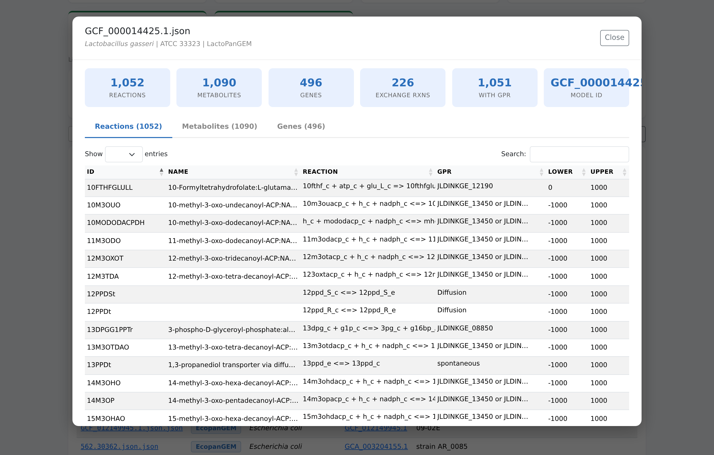
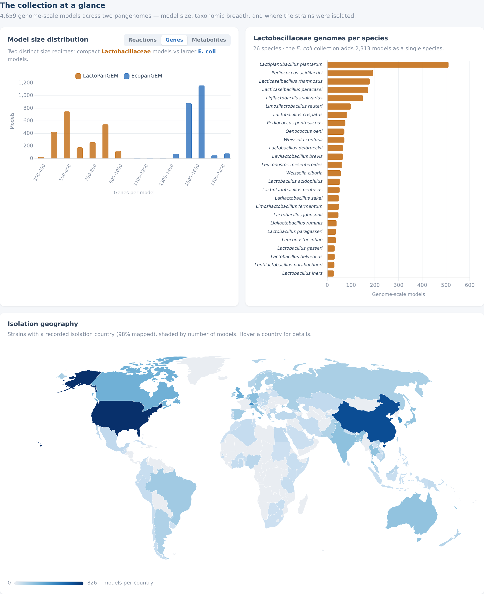
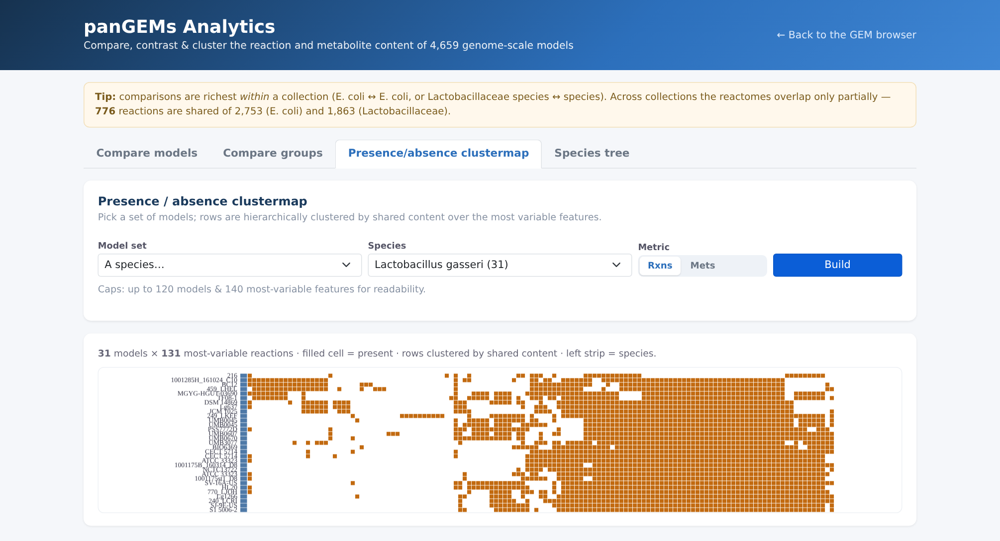
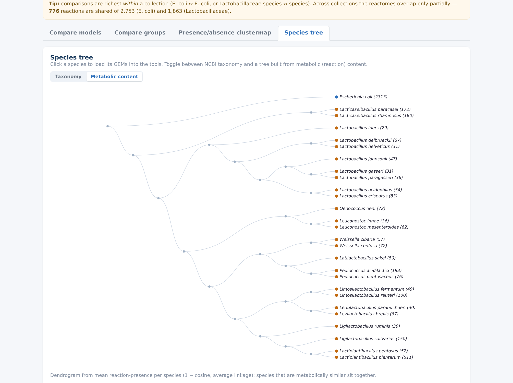

# panGEMs

**A unified browser for strain-specific genome-scale metabolic models (GEMs) of _Escherichia coli_ and the _Lactobacillaceae_ family.**

🔗 **Live browser:** https://omidard.github.io/panGEMs/

panGEMs brings two large pangenome-scale GEM collections into a single searchable,
filterable, downloadable web interface — no server, no install, everything runs in your browser.

<p align="center">
  <a href="https://omidard.github.io/panGEMs/">
    <br>
    <em>Click any of the 4,659 models to explore its reactions, metabolites and genes in the browser.</em>
  </a>
</p>

<p align="center">
  <br>
  <em>The landing page dashboard — model size, taxonomic breadth, and isolation geography, all interactive.</em>
</p>

<p align="center">
  <a href="https://omidard.github.io/panGEMs/analytics.html">
    
    <br>
    <em>Analytics workspace — presence/absence clustermaps and a metabolic-content species tree.</em>
  </a>
</p>

| Collection | Organism(s) | Models | Format | Source |
|---|---|---:|---|---|
| **EcopanGEM** | _Escherichia coli_ | 2,313 | JSON | [omidard/EcopanGEM](https://github.com/omidard/EcopanGEM) · [Zenodo 17581962](https://zenodo.org/records/17581962) |
| **LactoPanGEM** | _Lactobacillaceae_ (26 species, 13 genera) | 2,346 | JSON | [omidard/LactoPanGEM](https://github.com/omidard/LactoPanGEM) |
| **Total** | | **4,659** | | |

---

## What you can do

- **See the collection at a glance** — an interactive landing dashboard: model-size
  distribution (reactions / genes / metabolites), _Lactobacillaceae_ genomes per species,
  and a **clickable world map** of isolation geography (click a country to filter the table).
- **[Analytics workspace](https://omidard.github.io/panGEMs/analytics.html)** — compare
  the reaction & metabolite content of the models:
  - **Compare models** — pick two or more and see shared / unique reactions, pairwise
    similarity, and a differential presence table.
  - **Compare groups** — define cohorts by species or metadata and contrast their
    repertoires (core / pan, size distributions, differential prevalence).
  - **Presence/absence clustermap** — hierarchically-clustered heatmap over the most
    variable reactions/metabolites for any selected set.
  - **Species tree** — a clickable cladogram, as NCBI taxonomy *or* a dendrogram built
    from metabolic (reaction) content; click a species to load its GEMs into the tools.
- **Browse & search** 4,659 GEMs in one table, with rich per-model metadata.
- **Filter** by dataset, organism (species), isolation source, country, and host.
- **Inspect any model in the browser** — click a GEM file to view its full reaction,
  metabolite, and gene tables (parsed live from the model JSON).
- **Download a custom subset** — select rows and download just those models, repackaged
  into a single zip entirely client-side.
- **Download the full archives** from their source repositories.
- **Export** the (filtered) metadata table as CSV.

> This browser mirrors the [EcopanGEM browser](https://omidard.github.io/EcopanGEM/)
> but covers both pangenomes. It intentionally **does not** include the in-browser flux
> analysis (FBA/pFBA/FVA) tooling — it is a browse-and-download resource.

---

## The Lactobacillaceae species

`Lacticaseibacillus paracasei`, `Lacticaseibacillus rhamnosus`, `Lactiplantibacillus pentosus`,
`Lactiplantibacillus plantarum`, `Lactobacillus acidophilus`, `Lactobacillus crispatus`,
`Lactobacillus delbrueckii`, `Lactobacillus gasseri`, `Lactobacillus helveticus`,
`Lactobacillus iners`, `Lactobacillus johnsonii`, `Lactobacillus paragasseri`,
`Latilactobacillus sakei`, `Lentilactobacillus parabuchneri`, `Leuconostoc inhae`,
`Leuconostoc mesenteroides`, `Levilactobacillus brevis`, `Ligilactobacillus ruminis`,
`Ligilactobacillus salivarius`, `Limosilactobacillus fermentum`, `Limosilactobacillus reuteri`,
`Oenococcus oeni`, `Pediococcus acidilactici`, `Pediococcus pentosaceus`,
`Weissella cibaria`, `Weissella confusa`.

---

## Metadata provenance

Each GEM is identified by its genome assembly accession:

- **E. coli (EcopanGEM):** models are named `<genome_id>.json.json`; metadata is the curated
  BV-BRC/PATRIC-derived table shipped with EcopanGEM (phylogroup, MLST, serovar, isolation,
  host, genome and model statistics).
- **Lactobacillaceae (LactoPanGEM):** models are named `<RefSeq assembly accession>.json`
  (e.g. `GCF_000014425.1.json`). The source repository ships the models grouped in
  per-species zips **without a per-model metadata table**, so this metadata was assembled here:
  - **NCBI Datasets** (`datasets summary genome accession`) for organism name, strain,
    assembly level, genome length, GC%, contig/chromosome counts, BioProject, BioSample,
    paired GenBank accession, submitter, and release date — resolved for **2,342 / 2,346**
    accessions.
  - **Species assignment** taken from the LactoPanGEM per-species archive each model came from.
  - **Isolation/host enrichment** merged from the project's Lactobacillaceae reactome metadata
    where accessions overlap.
  - **Per-model statistics** (reactions, metabolites, genes, exchange reactions, reactions with
    GPR) computed directly from each model JSON.
  - 4 accessions have been withdrawn/suppressed from NCBI RefSeq; those rows carry the species
    assignment and model statistics only (noted in the `Comments` column).

---

## Model format

All models are **COBRApy-compatible JSON** and load directly:

```python
import cobra
model = cobra.io.load_json_model("GCF_000014425.1.json")     # Lactobacillaceae
model = cobra.io.load_json_model("562.70503.json.json")      # E. coli
print(model.optimize())
```

SBML versions of the Lactobacillaceae models are available in the
[LactoPanGEM](https://github.com/omidard/LactoPanGEM) repository.

---

## Repository layout

```
panGEMs/
├── README.md
├── LICENSE
└── docs/                        # GitHub Pages site root
    ├── index.html               # the browser (single self-contained page)
    ├── analytics.html           # analytics workspace (compare / cluster / tree)
    ├── gems_metadata.json       # unified metadata, 4,659 rows
    ├── gem_batches.json         # gem_file → batch-zip number
    ├── assets/
    │   ├── dashboard.js         # landing dashboard (Chart.js + d3)
    │   ├── dashboard.json       # precomputed size / species / geo aggregates
    │   ├── world.geojson        # slim Natural Earth 110m countries (ISO_A3)
    │   ├── analytics.js         # analytics tools (bit-matrix math + Chart.js + d3)
    │   ├── presence_reactions.bin / presence_metabolites.bin   # bit-packed presence
    │   ├── reactions_vocab.json / metabolites_vocab.json       # feature vocabularies
    │   ├── presence_manifest.json                              # dims + model row order
    │   └── *.png                # screenshots
    └── gems/
        ├── gems_batch_01..10.zip   # E. coli GEMs (from EcopanGEM)
        └── gems_batch_11..47.zip   # Lactobacillaceae GEMs
```

The site downloads only the batch zip(s) it needs to inspect or export a selection,
so the page stays fast even though the full collection is ~450 MB.

---

## Citation

If you use these models, please cite the source studies:

- **E. coli:** Ardalani _et al._, "Annotating the Pangenome Reveals the Diversity in the
  Genetic Basis for Metabolic Enzymes." ([EcopanGEM](https://github.com/omidard/EcopanGEM),
  Zenodo [10.5281/zenodo.17581962](https://zenodo.org/records/17581962))
- **Lactobacillaceae:** Ardalani _et al._, "Pangenome-Scale Reconstruction of
  _Lactobacillaceae_ Metabolism," _mSystems_ (2024).
  ([LactoPanGEM](https://github.com/omidard/LactoPanGEM))

Genome metadata for the Lactobacillaceae collection is derived from
[NCBI Datasets](https://www.ncbi.nlm.nih.gov/datasets/).

## License

MIT — see [LICENSE](LICENSE).
